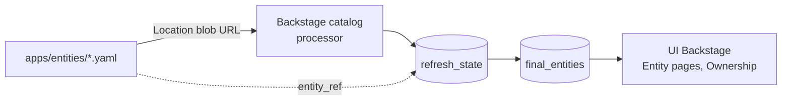

# backstage-workloads

Entidades estáticas de catálogo Backstage (**Systems y Resources**) y
almacén legacy de Crossplane `LocalDeployment` claims.

<p>
   Backstage
   Kubernetes
   Crossplane
   Kong
</p>

## Estructura actual

```
apps/
└── entities/
    ├── kubernetes-cluster.yaml      # Resource (cluster K8s principal)
    └── infrastructure-system.yaml   # System  (infra base: Argo, Kong, Backstage…)
```

## Cómo estas entidades llegan al catálogo



Las entidades se registran como **Location tipo `url`** apuntando a la URL `blob`
de GitHub (no `raw` — la variante `blob` funciona para locations HTTP directas
con token de integración, aunque no para `catalog:register` headless).

Ubicaciones actuales en el catálogo (tabla `locations`):

```text
url  https://github.com/gusLopezC-DevOps/backstage-workloads/blob/main/apps/entities/kubernetes-cluster.yaml
url  https://github.com/gusLopezC-DevOps/backstage-workloads/blob/main/apps/entities/infrastructure-system.yaml
```

## Entidades detalladas

### `kubernetes-cluster` (Resource)

```yaml
apiVersion: backstage.io/v1alpha1
kind: Resource
metadata:
  name: kubernetes-cluster
  description: Main Kubernetes cluster
  annotations:
    kyverno.io/endpoint: http://policy-reporter.workloads.svc:8080
spec:
  type: kubernetes-cluster
  owner: development
  system: infrastructure          # pertenece al System "infrastructure"
```

- Representa el cluster k3s (IP `192.168.100.77`) en el que corren Backstage y
  los workloads.
- La annotation `kyverno.io/endpoint` apunta al Policy Reporter (monitoring de
  Kyverno para informes de seguridad).

### `infrastructure` (System)

```yaml
apiVersion: backstage.io/v1alpha1
kind: System
metadata:
  name: infrastructure
  description: Core infrastructure systems
spec:
  owner: development
```

- Agrupa todos los sistemas de plataforma: Argo CD, Kong, Backstage, PostgreSQL,
  cert-manager, Kyverno, Crossplane, sealed-secrets.
- Permite visualizar en Backstage la relación `Resource → System → Componentes`.

## Claims legacy (borrados)

Antes existían `apps/workloads/` con claims crossplane (`LocalDeployment`):
`demo-final-app`, `test-golden-path`, `test-golden-path2`.

- Fueron removidos del **catálogo de Backstage** (ya no son componentes visibles).
- Los directorios se borraron de este repo.
- El patrón se conserva: el template `k8s-manifests` de Backstage escribe nuevos
  claims en `apps/workloads/<appName>/` (commit automático vía `gitops:push-to-repo`).
- Aplicar un claim nuevo: `kubectl -k apps/workloads/<appName>` (requiere
  la composición `XLocalDeployment` instalada en el cluster; ver `backstage-gitops`).

## Añadir una nueva entidad estática

1. Crear el fichero `apps/entities/<nombre>.yaml` (siguiendo el formato Backstage
   `v1alpha1`, con `spec.owner: development`).
2. Registrar la Location en el catálogo (register en la UI con la URL `blob`
   del fichero, o añadir desde el `override.yaml` si fuera tipo `file`).
3. Verificar con la query:

```sql
SELECT entity_ref FROM refresh_state WHERE entity_ref LIKE 'system:%' OR entity_ref LIKE 'resource:%';
```

## Política de borrado

- Si un claim crossplane ya no se usa: quitar su Location del catálogo + borrar
  `refresh_state` (ver `backstage-gitops/docs/catalogo.md`).
- Si una entidad System/Resource ya no aplica: borrar el fichero del repo + quitar
  la Location (evita churn de refresh con 404).